<h1>Author: Panagiotis Fiskilis</h1>

<h2>Challenge name: Try Hack Me: Squid Game</h2>

---

<center>Table of contents:</center>

1. [Scenario](#scenario)

2. [Attacker 1](#attacker1)

3. [Attacker 2](#attacker2)

4. [Attacker 3](#attacker3)

5. [Attacker 4](#attacker4)

6. [Attacker 5](#attacker5)

---

<h3>Scenario</h3>

<a name="scenario">

<br>

Q:<code>Accept the invitation? (Yes/No) </code>

A:```Yes```

<h3>Attacker 1</h3>

<a name="attacker1">

<br>

Q1: <code>What is the malicious C2 domain you found in the maldoc where an executable download was attempted?</code>

A: <code>fpetraardella.band/xap_102b-AZ1/704e.php?l=litten4.gas</code>

Uploaded the sample <code>Attacker1.doc</code> on Hybrid analysis and got the domain along side the IP of it:

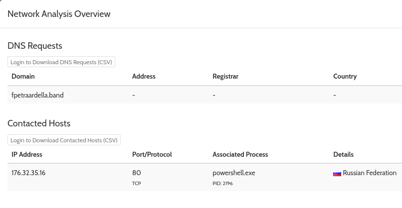

Hybrid-Analysis link:

```
https://www.hybrid-analysis.com/sample/2979b5fbb454e2f13d89e58177f8c1f881bd3f0a0bebb1d27da9e189ba9d284e#
```

After some extra search on the report I found this cute payload:

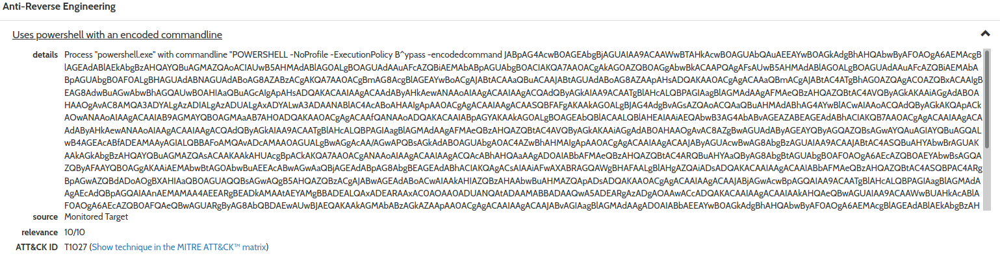

This payload is a base64 encoded payload after the decode we get the flag:

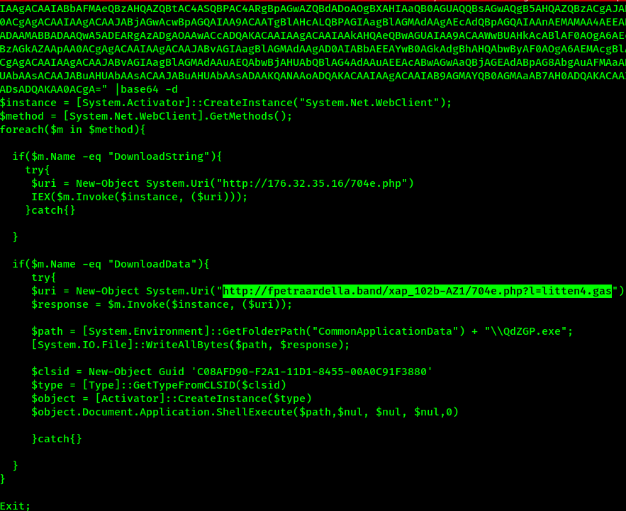

Q2: <code>What executable file is the maldoc trying to drop?</code>

A:<code>QdZGP.exe</code>

From the previous deobfuscation attempt we get this:

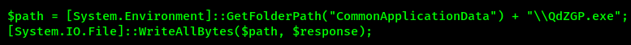

Q3: <code>In what folder is it dropping the malicious executable? (hint: %Folder%)</code>

A: <code>%ProgramData%</code>

I had to evaluate the following statement on a Windows host to get the path:

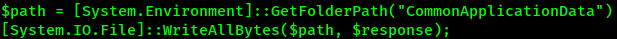

Q4: <code>Provide the name of the COM object the maldoc is trying to access.</code>

A: <code>ShellBrowserWindow</code>

I didn't know how to search for this so I googled: <code>C08AFD90-F2A1-11D1-8455-00A0C91F3880</code>.

The first result can give us the flag:

```
https://strontic.github.io/xcyclopedia/library/clsid_c08afd90-f2a1-11d1-8455-00a0c91f3880.html
```

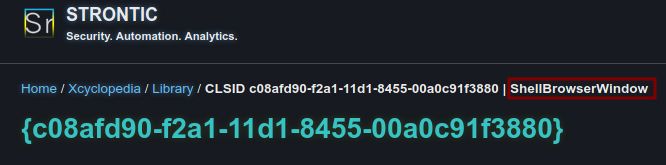

Q5: <code>Include the malicious IP and the php extension found in the maldoc. (Format: IP/name.php)</code>

A: <code>176.32.35.16/704e.php</code>

Used [Virus total](https://www.virustotal.com/gui/file/2979b5fbb454e2f13d89e58177f8c1f881bd3f0a0bebb1d27da9e189ba9d284e/relations)

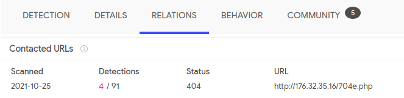

Q6: <code>Find the phone number in the maldoc. (Answer format: xxx-xxx-xxxx)</code>

A: <code>213-446-1757</code>

```bash
strings attacker1.doc |grep "-"
```

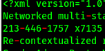

Q7: <code>Doing some static analysis, provide the type of maldoc this is under the keyword “AutoOpen”.</code>

A: <code>AutoExec</code>

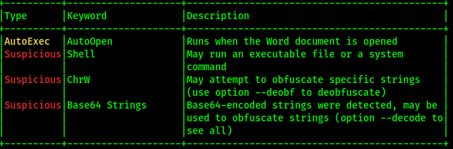

Q8: <code>Provide the subject for this maldoc. (make sure to remove the extra whitespace)</code>

A: <code>West Virginia  Samant</code>

We can either use:

- file
- exiftoll

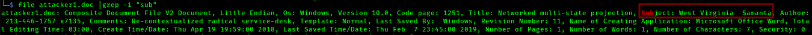

Q9: <code>Provide the time when this document was last saved. (Format: YEAR-MONTH-DAY XX:XX:XX)</code>

A: <code>2019-02-07 23:45:30</code>

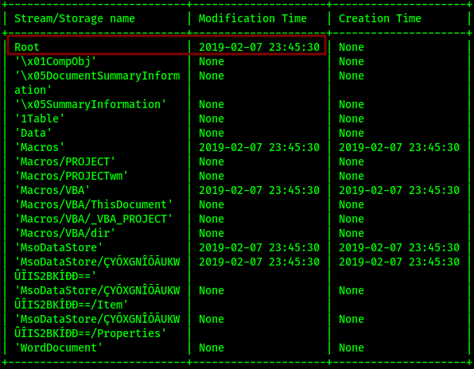

Q10: <code>Provide the stream number that contains a macro.</code>

A: <code>8</code>

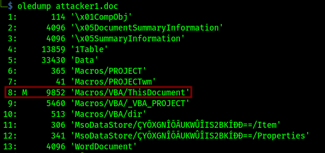

Q11: <code>Provide the name of the stream that contains a macro.</code>

A: <code>ThisDocument</code>

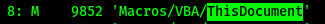

<h3>Attacker 2</h3>

<a name="attacker2">

<br>

<h3>Attacker 3</h3>

<a name="attacker3">

<br>

<h3>Attacker 4</h3>

<a name="attacker4">

<br>

<h3>Attacker 5</h3>

<a name="attacker5">
